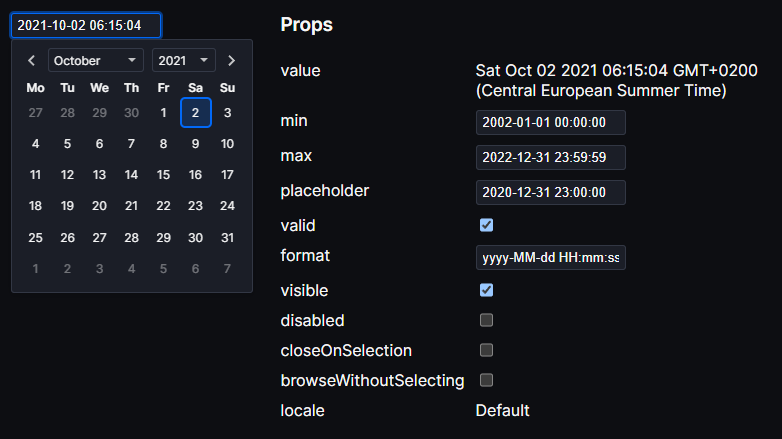

# Date Picker Svelte

[](https://npmjs.com/package/date-picker-svelte)
[](LICENSE)
[](https://npmjs.com/package/date-picker-svelte)
[](https://github.com/probablykasper/date-picker-svelte/actions/workflows/test.yml)

Date and time picker for Svelte

Features:
- Theming
- Custom formats
- Internationalization (i18n)
- Autopunctuation (e.g typing "20201111111111" gives you "2020-11-11 11:11:11" with the default format)
- Keyboard shortcuts

[Demo](https://date-picker-svelte.kasper.space/demo) • [Documentation](https://date-picker-svelte.kasper.space/docs) • [REPL](https://svelte.dev/repl/044911429c4b4e659362518d9a5deaae?version=4)



## Install

```
npm install date-picker-svelte
```

## Usage

```svelte
<script>
	import { DateInput } from 'date-picker-svelte'
	let date = new Date()
</script>

<DateInput bind:value={date} />
```

Check the [docs](https://date-picker-svelte.kasper.space/docs) to learn more

## Contributing

### Get started

1. Install Node.js (v14 works)
2. Run `npm install`

### Commands

- `npm run dev`: Start site in dev mode
- `npm run build`: Build package and site
- `npm run preview`: Preview production site
- `npm run check`: Run `svelte-check`
- `npm run test`: Run tests
- `npm run format`: Format code

### Publish new version

1. Update `CHANGELOG.md`
2. Check for errors
	```
	npm run lint
	```
3. Bump the version number
	```
	npm version --no-git-tag <version>
	```
4. Publish
	```
	npm publish
	```
5. Commit with a tag in format "v#.#.#"
6. Create GitHub release with release notes
